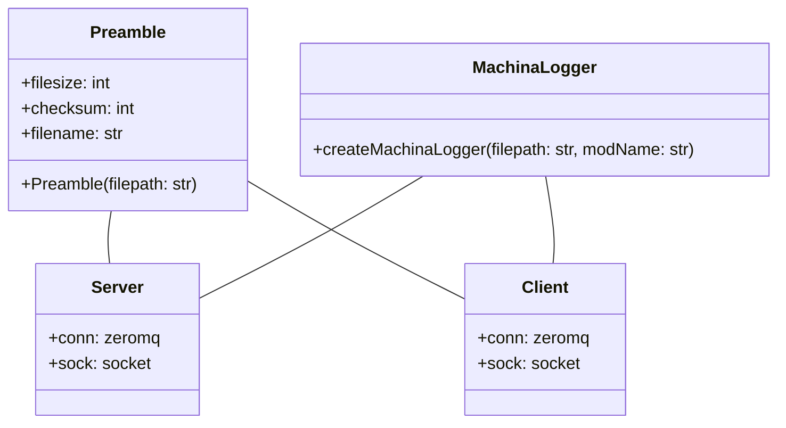
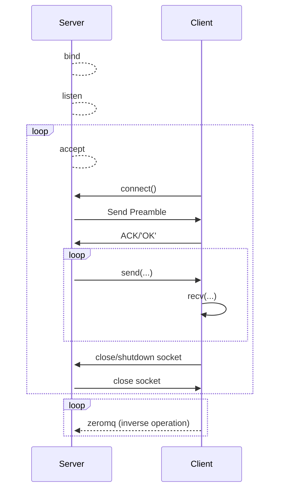

 # About 

For my implementation I have chosen the network socket method of transferring the file, as well as zeromq.

More specifically, for the network socket impl I have chosen to utilize TCP/IP specifically (not UDP).

Language chosen was python3

# Building, Running, and Testing

Although python should run on most machines, I recommend using the Dockerfile to build a container to run the project in.

This has the added benefit of testing the requirement

> Alternatively the two processes A & B could be deployed and run on two independent work stations.

## Docker build

To build, make sure you are in the top most directory of the repo (where Dockerfile and cad_mesh.stl file are located).

From there, run this command:

```shell
docker build -t machinaftp:latest .
```

## Running/Testing the code

Now you should be able to do the following and verify you have a Docker image called `machinaftp` like so:

```shell
sletzer@Sean-Gaming-Rig:~/INTERVIEWS/machina_network_interview_takehome$ docker images
REPOSITORY   TAG       IMAGE ID       CREATED         SIZE
machinaftp   latest    489917b27b79   3 minutes ago   958MB
```

From there we will spin up 2 temporary containers (call them remote1 and remote2):

```shell
sletzer@Sean-Gaming-Rig:~/INTERVIEWS/machina_network_interview_takehome$ docker run --name remote1 --rm -it machinaftp /bin/bash
root@6cdbed1306f0:~# pwd
/root
root@6cdbed1306f0:~# ls
Dockerfile  README.md  TODO  cad_mesh.stl  src
```

Launch `runner.py` on the server container first:

```shell
root@6cdbed1306f0:~# python3 ./src/runner.py -h
usage: runner.py [-h] [-s] [-c] -f FILENAME -H HOST -p PORT [--remotehost REMOTEHOST]

A simple server/client program to demonstrate sending files using a variety of network libraries

options:
  -h, --help            show this help message and exit
  -s, --server          Start the server process
  -c, --client          Start the client process
  -f FILENAME, --filename FILENAME
                        The file to be delivered to the client (if the server) or where to write the file that is being received (if the client)
  -H HOST, --host HOST  The host IP address (to bind to for server, connect to for client)
  -p PORT, --port PORT  port (for server to listen on, for client to connect to)
  --remotehost REMOTEHOST
                        The remote IP of the machine running in client mode


root@6cdbed1306f0:~# ifconfig
eth0: flags=4163<UP,BROADCAST,RUNNING,MULTICAST>  mtu 1500
        inet 172.17.0.2  netmask 255.255.0.0  broadcast 172.17.255.255
        ether 02:42:ac:11:00:02  txqueuelen 0  (Ethernet)
        RX packets 13  bytes 1046 (1.0 KiB)
        RX errors 0  dropped 0  overruns 0  frame 0
        TX packets 0  bytes 0 (0.0 B)
        TX errors 0  dropped 0 overruns 0  carrier 0  collisions 0

root@6cdbed1306f0:~# python3 ./src/runner.py --server -f ./cad_mesh.stl -H 172.17.0.2 -p 8080 --remotehost 172.17.0.3
```

After booting up the client process, then you should see the following output:

```shell
#SERVER
root@6cdbed1306f0:~# python3 ./src/runner.py --server -f ./cad_mesh.stl -H 172.17.0.2 -p 8080 --remotehost 172.17.0.3
Done! - TX
Done! - RX
root@6cdbed1306f0:~# ls
Dockerfile  README.md  TODO  cad_mesh.stl  output.stl  server.log  src
```

**Notice** in the server ls output we now have `output.stl` this is the file as it traversed the __RX__ path (implemented with pyzmq).

```shell
#CLIENT
root@9f12b5ecb836:~# python3 ./src/runner.py --client -f output.stl -H 172.17.0.2 -p 8080
Done! - RX
Done! - TX
root@9f12b5ecb836:~# ls
Dockerfile  README.md  TODO  cad_mesh.stl  client.log  output.stl  src
```

## Getting log output

Each respective pid/process will output a log file. On the server it is called `server.log` and will be written in the `cwd`:

```shell
root@6cdbed1306f0:~# cat server.log
2022-08-10 10:21:45,291 - machinalogger - INFO - About to create socket on 172.17.0.2 8080
2022-08-10 10:21:45,292 - machinalogger - DEBUG - ZeroMQ connected
2022-08-10 10:22:38,420 - machinalogger - DEBUG - Accepted new connection from ('172.17.0.3', 52674)
2022-08-10 10:22:38,422 - machinalogger - DEBUG - sent ./cad_mesh.stl successfully to ('172.17.0.3', 52674)
2022-08-10 10:22:38,422 - machinalogger - DEBUG - client <socket.socket [closed] fd=-1, family=AddressFamily.AF_INET, type=SocketKind.SOCK_STREAM, proto=0> has quit the connection
```

and `client.log` on the client

```shell
root@9f12b5ecb836:~# cat client.log
2022-08-10 10:22:38,419 - machinalogger - INFO - About to create socket
2022-08-10 10:22:38,420 - machinalogger - INFO - Successfully connected to 172.17.0.2:8080
2022-08-10 10:22:38,421 - machinalogger - DEBUG - Preamble metadata received: {'size': '714884', 'cksum': '1445675924'}
2022-08-10 10:22:38,423 - machinalogger - INFO - File successfully saved to output.stl
```

# Class diagram

Here is a following UML diagram that depicts the architecture for this network communications assignment.



The `Preamble` class is a data obj/utility class, that contains just enough information about the given file's metadata; such that the requirement of:

 > cad_mesh.stl must match output.stl

is met. It is actually serialized as JSON ASCII and sent on the wire prior to the server delivering the actual file.

The `MachinaLogger` module creates a standard logging mechanism such that each python module can have its own rotating log file with a standard format (day, time, level, etc).

The `Server` class contains all the logic necessary for generating a preamble, reading the file, and sending it to a client.

The `Client` like the name suggests has the responsibility of connecting to the server, getting the preamble and file data, and then verifying post-installation that the file was uncorrupted. An additional feature is to then parse the stl file and create a vertex csv file.

# Protocol for custom Network Socket Implementation

Here is a diagram depicting the protocol of the server/client:



**Notice** here that the server really doesn't care about any client requests, the only real feedback is an ACK that the preamble message was received correctly.

This is in [contrast to other FTP protocols](https://zguide.zeromq.org/docs/chapter7/#The-Cheap-or-Nasty-Pattern) (many of which are client driven). This design was not needed here as there is not much the client can request.