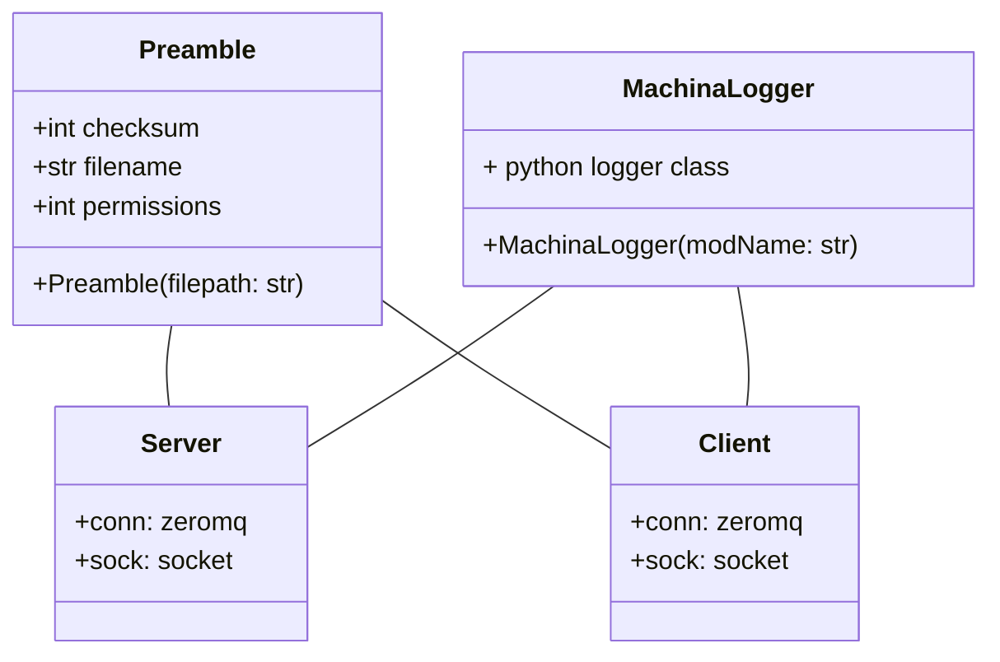

# About 

# Class diagram

Here is a following UML diagram that depicts the architecture for this network communications assignment.

```mermaid
classDiagram
    Preamble--Server
    Preamble--Client
    MachinaLogger--Server
    MachinaLogger--Client
    class Preamble {
        +int checksum
        +str filename
        +int permissions
        +Preamble(filepath: str)
    }
    class MachinaLogger{
        +MachinaLogger(modName: str)
        + python logger class
    }
    class Server {
        +conn: zeromq
        +sock: socket
    }
    class Client {
        +conn: zeromq
        +sock: socket
    }
```