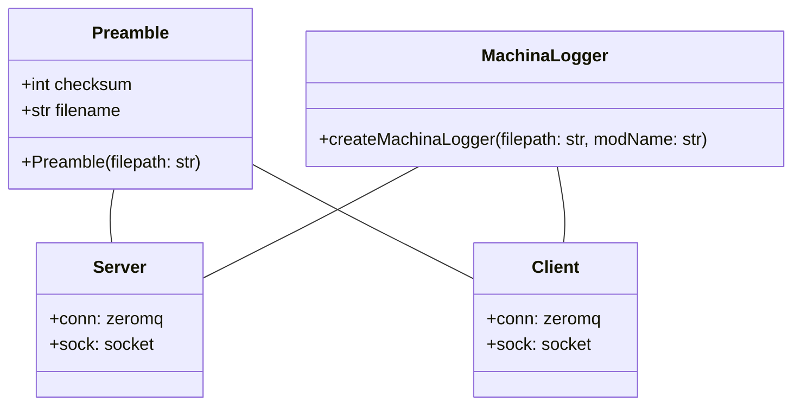
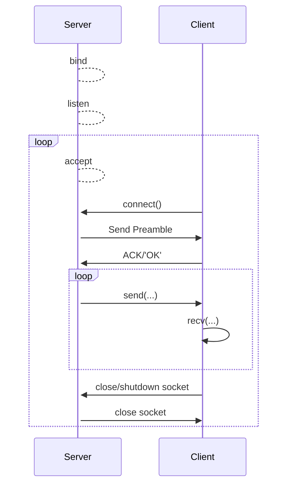

 # About 

For my implementation I have chosen the network socket method of transferring the file, as well as zeromq.

More specifically, for the network socket impl I have chosen to utilize TCP/IP specifically (not UDP).

# Building, Running, and Testing

TODO

# Class diagram

Here is a following UML diagram that depicts the architecture for this network communications assignment.

The `Preamble` class is a data obj/utility class, that contains just enough information about the given file's metadata; such that the requirement of:

 > cad_mesh.stl must match output.stl

is met. It is actually serialized as JSON ASCII and sent on the wire prior to the server delivering the actual file.

The `MachinaLogger` module creates a standard logging mechanism such that each python module can have its own rotating log file with a standard format (day, time, level, etc).

The `Server` class contains all the logic necessary for generating a preamble, reading the file, and sending it to a client.

The `Client` like the name suggests has the responsibility of connecting to the server, getting the preamble and file data, and then verifying post-installation that the file was uncorrupted. An additional feature is to then parse the stl file and create a vertex csv file.

# Protocol for custom Network Socket Implementation

Here is a diagram depicting the protocol of the server/client:

**Notice** here that the server really doesn't care about any client requests, the only real feedback is an ACK that the preamble message was received correctly.

This is in contrast to other FTP protocols (many of which are client driven). This design was not needed here as there is not much the client can request.